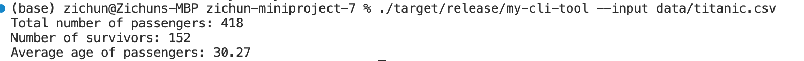
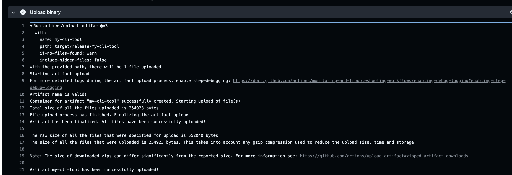

# My CLI Tool

A command-line tool built in Rust for processing CSV data.

## Installation

1. Clone the repository:
   ```bash
   git clone https://github.com/nogibjj/zichun-miniproject-7.git
   cd zichun-miniproject-7
   ```

2. Build the project:
   ```bash
   cargo build --release
   ```

3. The compiled binary will be located in the `target/release/` directory. You can copy it to a location in your `PATH` for global use:
   ```bash
   cp target/release/my-cli-tool /usr/local/bin/
   ```

## Usage

To use the tool, you can specify the dataset included in this repository:

```bash
./my-cli-tool --input data/titanic.csv
```

This command will process the provided `titanic.csv` dataset and output results like the total number of passengers, the number of survivors, and the average age.



## Dataset

The project includes the `titanic.csv` dataset located in the `data/` folder within this repository. You can use it for testing purposes.

If you'd like to use a different dataset, make sure it follows a format similar to `titanic.csv` with columns like `PassengerId`,`Survived`,`Pclass`,`Name`,`Sex`,`Age`,`SibSp`,`Parch`,`Ticket`,`Fare`,`Cabin`,`Embarked`.

## CI/CD

The project is built and tested automatically using GitHub Actions. You can view the build status by navigating to the Actions tab of this repository.Also, see artifact here in the screenshot.
